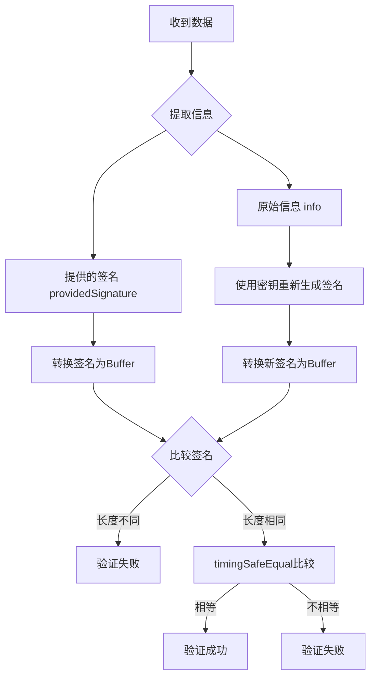

# 🔐 鉴权指南 - HMAC 签名验证完整流程

## 📋 目录

1. [概述](#概述)
2. [核心概念](#核心概念)
3. [签名生成流程](#签名生成流程)
4. [签名验证流程](#签名验证流程)
5. [安全特性](#安全特性)
6. [实际应用场景](#实际应用场景)
7. [代码实现详解](#代码实现详解)
8. [常见签名情况分析](#常见签名情况分析)
9. [最佳实践建议](#最佳实践建议)

## 🎯 概述

本文档详细阐述基于 HMAC-SHA256 的签名验证机制，用于确保数据完整性、身份验证和防篡改保护。该机制广泛应用于 API 接口安全、数据传输验证等场景。

## 🔑 核心概念

### HMAC (Hash-based Message Authentication Code)

- **定义**：基于哈希函数的消息认证码
- **算法**：HMAC-SHA256
- **特点**：需要密钥参与计算，提供身份验证功能

### 关键要素

```typescript
interface SignatureElements {
  info: string; // 原始信息（需要保护的数据）
  key: string; // 密钥（只有通信双方知道）
  signature: string; // 生成的签名（十六进制字符串）
}
```

## 📝 签名生成流程

### 步骤详解

```mermaid
graph TD
    A[原始信息 info] -->|输入| B[HMAC-SHA256算法]
    C[密钥 key] -->|输入| B
    B -->|计算结果| D[二进制哈希值]
    D -->|digest\("hex"\)| E[十六进制签名 signature]
```

### 代码实现

```typescript
function generateSignature(info: string, key: string): string {
  return crypto.createHmac("sha256", key).update(info).digest("hex");
}
```

### 示例

```typescript
const info = "user123:login:2024-01-01";
const key = "my_secret_key_2024";
const signature = generateSignature(info, key);
// 输出: "a1b2c3d4e5f6..." (64位十六进制字符串)
```

## ✅ 签名验证流程

### 验证步骤



### 完整验证函数

```typescript
function verifySignature(
  info: string,
  key: string,
  providedSignature: string
): boolean {
  // 1. 重新生成期望的签名
  const expectedSignature = generateSignature(info, key);

  // 2. 转换为Buffer进行安全比较
  const expectedBuffer = Buffer.from(expectedSignature, "hex");
  const providedBuffer = Buffer.from(providedSignature, "hex");

  // 3. 长度检查（快速失败）
  if (expectedBuffer.length !== providedBuffer.length) {
    return false;
  }

  // 4. 安全比较（防时序攻击）
  return crypto.timingSafeEqual(expectedBuffer, providedBuffer);
}
```

## 🛡️ 安全特性

### 1. 数据完整性保护

- **作用**：确保数据在传输过程中未被篡改
- **原理**：任何数据修改都会导致签名验证失败

### 2. 身份验证

- **作用**：验证通信双方的身份
- **原理**：只有拥有正确密钥的一方才能生成有效签名

### 3. 防时序攻击

- **威胁**：攻击者通过测量响应时间差异来猜测正确签名
- **防护**：`crypto.timingSafeEqual()`确保比较时间恒定

### 4. 不可抵赖性

- **作用**：签名方无法否认生成过该签名
- **原理**：只有知道密钥才能生成有效签名

## 🎮 实际应用场景

### 场景 1：API 请求验证

```typescript
// 客户端
const timestamp = Date.now();
const data = { userId: 123, action: "buy", amount: 100 };
const signature = generateSignature(
  JSON.stringify(data) + timestamp,
  secretKey
);

// 发送请求
fetch("/api/buy", {
  method: "POST",
  headers: {
    "X-Signature": signature,
    "X-Timestamp": timestamp,
  },
  body: JSON.stringify(data),
});

// 服务端验证
const isValid = verifySignature(
  JSON.stringify(req.body) + req.headers["x-timestamp"],
  secretKey,
  req.headers["x-signature"]
);
```

### 场景 2：JWT 令牌增强

```typescript
// 生成带签名的JWT载荷
const payload = {
  userId: user.id,
  role: user.role,
  timestamp: Date.now(),
};

const signature = generateSignature(JSON.stringify(payload), jwtSecret);
const token = btoa(JSON.stringify(payload)) + "." + signature; // 编码为Base64
```

### 场景 3：文件完整性校验

```typescript
// 上传文件时生成签名
const fileHash = await calculateFileHash(file);
const signature = generateSignature(fileHash, serverSecret);

// 下载时验证
const isValid = verifySignature(
  calculatedHash,
  serverSecret,
  providedSignature
);
```

## 💻 代码实现详解

### 完整实现代码

```typescript
import crypto from "node:crypto";

/**
 * 生成HMAC签名
 * @param info - 要签名的信息
 * @param key - 签名密钥
 * @returns HMAC签名结果（64位十六进制字符串）
 */
function generateSignature(info: string, key: string): string {
  return crypto.createHmac("sha256", key).update(info).digest("hex");
}

/**
 * 验证HMAC签名
 * @param info - 原始信息
 * @param key - 签名密钥
 * @param providedSignature - 提供的签名
 * @returns 签名是否有效
 */
function verifySignature(
  info: string,
  key: string,
  providedSignature: string
): boolean {
  // 生成期望的签名
  const expectedSignature = generateSignature(info, key);

  // 转换为Buffer进行安全比较
  const expectedBuffer = Buffer.from(expectedSignature, "hex");
  const providedBuffer = Buffer.from(providedSignature, "hex");

  // 快速长度检查
  if (expectedBuffer.length !== providedBuffer.length) {
    return false;
  }

  // 使用timingSafeEqual防止时序攻击
  return crypto.timingSafeEqual(expectedBuffer, providedBuffer);
}
```

## 🔍 常见签名情况分析

### 情况 1：签名正确 ✅

```typescript
const info = "hello";
const key = "123456";
const signature = generateSignature(info, key); // "2cf24dba..."
const isValid = verifySignature(info, key, signature); // true
```

**结果**：验证通过，数据可信

### 情况 2：签名被篡改 ❌

```typescript
const tamperedSignature = "wrong_signature_12345";
const isValid = verifySignature(info, key, tamperedSignature); // false
```

**结果**：验证失败，签名无效

### 情况 3：原始信息被篡改 ❌

```typescript
const isValid = verifySignature("hello_modified", key, signature); // false
```

**结果**：验证失败，数据被篡改

### 情况 4：密钥错误 ❌

```typescript
const isValid = verifySignature(info, "wrong_key", signature); // false
```

**结果**：验证失败，身份验证不通过

### 情况 5：签名长度不匹配 ❌

```typescript
const shortSignature = "abc123";
const isValid = verifySignature(info, key, shortSignature); // false
```

**结果**：快速失败，签名格式错误

## 🚀 最佳实践建议

### 1. 密钥管理

```typescript
// ✅ 推荐：环境变量存储
const secretKey = process.env.HMAC_SECRET_KEY;

// ❌ 避免：硬编码密钥
const secretKey = "my_fixed_secret_key_12345";
```

### 2. 密钥轮换

```typescript
// 实现密钥版本控制
const keyVersions = {
  v1: process.env.HMAC_KEY_V1, // 旧密钥
  v2: process.env.HMAC_KEY_V2, // 新密钥
};

// 验证时尝试多个密钥版本
function verifyWithKeyRotation(info: string, signature: string): boolean {
  return Object.values(keyVersions).some((key) =>
    verifySignature(info, key, signature)
  );
}
```

### 3. 添加时间戳防重放

```typescript
function createSecureSignature(
  data: any,
  key: string
): { signature: string; timestamp: number } {
  const timestamp = Date.now();
  const signature = generateSignature(JSON.stringify(data) + timestamp, key);
  return { signature, timestamp };
}

function verifySecureSignature(
  data: any,
  key: string,
  signature: string,
  timestamp: number
): boolean {
  // 检查时间戳是否在有效范围内（5分钟）
  const now = Date.now();
  if (Math.abs(now - timestamp) > 5 * 60 * 1000) {
    return false; // 请求过期
  }

  return verifySignature(JSON.stringify(data) + timestamp, key, signature);
}
```

### 4. 错误处理

```typescript
function safeVerifySignature(
  info: string,
  key: string,
  signature: string
): boolean {
  try {
    // 输入验证
    if (!info || !key || !signature) {
      return false;
    }

    // 签名格式验证
    if (!/^[a-f0-9]{64}$/i.test(signature)) {
      return false;
    }

    return verifySignature(info, key, signature);
  } catch (error) {
    console.error("签名验证错误:", error);
    return false;
  }
}
```

### 5. 性能优化

```typescript
// 缓存常用签名（适用于重复数据）
const signatureCache = new Map<string, string>();

function generateCachedSignature(info: string, key: string): string {
  const cacheKey = `${info}:${key}`;

  if (signatureCache.has(cacheKey)) {
    return signatureCache.get(cacheKey)!;
  }

  const signature = generateSignature(info, key);
  signatureCache.set(cacheKey, signature);

  return signature;
}
```

## 📊 性能与安全对比

| 方案        | 安全性     | 性能       | 适用场景               |
| ----------- | ---------- | ---------- | ---------------------- |
| HMAC-SHA256 | ⭐⭐⭐⭐⭐ | ⭐⭐⭐⭐   | API 验证、数据完整性   |
| RSA 签名    | ⭐⭐⭐⭐⭐ | ⭐⭐       | 数字证书、法律文件     |
| MD5 哈希    | ⭐⭐       | ⭐⭐⭐⭐⭐ | 文件校验（非安全场景） |
| 纯 SHA256   | ⭐⭐⭐     | ⭐⭐⭐⭐   | 数据指纹（无密钥）     |

## 🎯 总结

HMAC-SHA256 签名验证机制提供了：

- **数据完整性**：确保数据未被篡改
- **身份验证**：验证通信双方身份
- **防时序攻击**：使用安全比较方法
- **高性能**：计算速度快，适合高并发场景
- **易实现**：代码简洁，易于集成

通过合理使用该机制，可以有效保护系统安全，防止数据篡改和身份伪造等安全威胁。

---

_最后更新：2024 年_  
_版本：v1.0_
